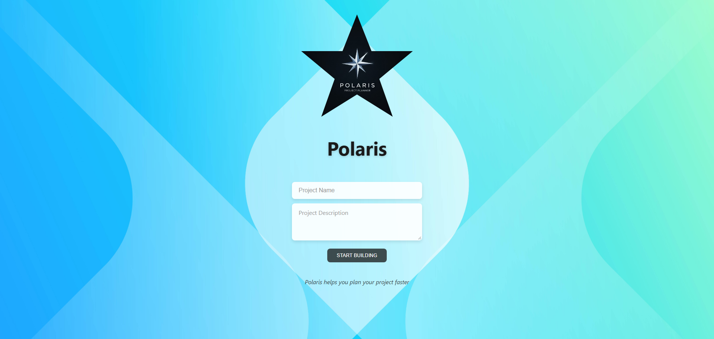

# 🚀 Polaris: Intelligent Project Scoping & Planning

> **Live Demo:** [https://www.polarisapp.online](https://www.polarisapp.online)  
> **Status:** v1.0 (Production Ready)  
> **Timeline:** Designed, Developed, and Deployed in 7 Days

## 💡 The Problem
Starting a new software project is often paralyzed by choice and vague requirements. Developers and teams waste hours debating:
* "Which tech stack components are compatible?"
* "How do we define the initial scope?"
* "How do we document the architecture for the team?"

## 🛠 The Solution
**Polaris** is a decision-support platform that streamlines project planning. It doesn't just list technologies; it validates them. I built an intuitive interface that offers **real-time compatibility validation**, ensuring developers select a robust stack (Frontend, Backend, Database) before writing a single line of code.

### ✨ Key Features
* **Interactive Tech Stack Selection:** A guided wizard to choose from popular modern technologies.
* **Real-Time Compatibility Engine:** Instant feedback on whether your selected technologies play well together.
* **Project Blueprint Generation:** Automatically exports a comprehensive, structured project plan.
* **Responsive Architecture:** Fully optimized for mobile and desktop workflows.

## 📸 Interface & Design

## ⚙️ Engineering Highlights (Under the Hood)
This project showcases **modern React 19 architecture** focused on performance and maintainability.

* **Performance:** Implemented **Lazy Loading** and code-splitting to ensure sub-second initial load times.
* **Modern Build Tooling:** leveraged **Vite 7** for lightning-fast HMR (Hot Module Replacement) and optimized production builds.
* **Clean Architecture:** Structured using modular components and **React Router DOM** for seamless client-side navigation.
* **Code Quality:** Enforced strict linting rules via **ESLint** to maintain a clean, collaborative codebase.

## 🚀 Tech Stack
* **Frontend:** React 19, JavaScript (ES6+)
* **Routing:** React Router DOM
* **Build Tool:** Vite 7
* **Styling:** Modern CSS3 (Responsive Flexbox/Grid)
* **Deployment:** [Vercel/Netlify/Hostinger - *Update this to your actual host*]

---
*Developed by [Bharrat Gehlot](https://www.bharratgehlot.com) - Frontend Developer available for Freelance & Contract roles.*
